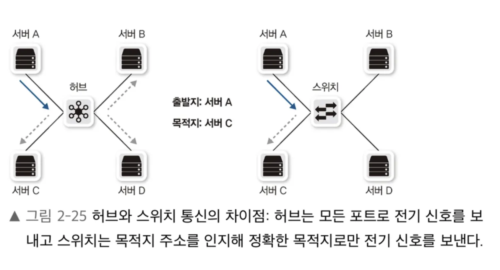

# 2장

> 네트워크 연결 방법을 구분하고, 연결에 필요한 회선과 구성요소를 정리
>

## 연결방법

네트워크는 규모와 관리 범위에 따라  LAN, MAN, WAN 3가지로 구분된다.

- **LAN (Local) : 사용자 내부 네트워크**
    - 홈/사무실 같은 소규모 네트워크거나, 자신의 건물 범위에 직접 선로로 구축한 네트워크
    - 현재는 대부분 이더넷 기반이다.
- MAN (Metro) : 도시 범위의 네트워크
- **WAN (Wide) : LAN끼리 연결해주는 네트워크**
    - 멀리 떨어진 LAN을 서로 연결하거나 인터넷에 접속하기 위한 네트워크
    - 개인이 구축할 수 있는 범위가 아니므로 통신사업자(ISP) 로부터 인터넷 회선을 임대해서 사용하고 있다.

---

### **0. 인터넷 회선**

**인터넷 접속을 위해 통신사업자와 연결하는 회선**

- 케이블 뿐 만 아니라 통신사업자가 판매하는 인터넷과 연결된 회선을 사용해야지만 인터넷 접속이 가능
- 아파트는 인터넷 전용회선처럼 보이지만 통신사업자 회선을 아파트 가입자들이 공유하는 구조
    - 전송 선로를 공유하기 때문에 최대 속도가 보장되어있지 않다.

### 1. 전용 회선

**가입자 - 통신사업자 간 대역폭을 보장해주는 서비스**

가입자 - 통신사업자 사이에 전용 케이블로 연결되어있고, 통신사업자 내부에서 TDM(시분할 다중화) 기술로 품질을 보장한다.

- 저속 : 음성전송 기술 기반
    - 64kps 단위로 작게 묶어 회선 접속 속도를 높임.
    - 아직 결제승인과 같은 전문전송을 위한 VAN 사는 대외 연결에 저속회선을 사용하여 높은 신뢰도를 추구하는 케이스가 있다.
    - 2계층 프로토콜 통신상태를 확인할 수 있어서 라우터에서 상대방 링크가 끊기면 감지 → 반대쪽 링크도 다운

- 고속 : 메트로 이더넷
    - 광케이블 기반 이더넷을 사용
    - 가입자는 LAN 쓰듯이 이더넷을 그대로 쓰고, 통신사업자는 내부적으로 가입자들을 구분해서 트래픽을 라우팅하는 방식
    - 전용 회선을 이더넷으로 구성할 때 **LLCF(Link Loss Carry Forward)**를 설정해야 한 쪽 링크가 다운되었는지 장애감지가 가능

> LLCF
>
> - 링크를 감지해서 상 하위 링크 중 어느 하나가 죽으면 장애를 감지해서 나머지 링크도 다운시키는 역할
    >     - 한 쪽 포트가 link down 상태가 되면 → 반대편 포트도 down → 상위 장비가 link down 이벤트를 받아서
>     - 트래픽을 failover 처리하는 등 신속하게 대응이 가능해진다.
> - 해당 설정이 없으면, 실제로는 통신이 불가능함에도 불구하고 트래픽을 전송하려고 함. (데이터 블랙홀)
 

### 2. VPN (Virtual Private Network)

물리적으로 전용선은 아니지만 가상으로 직접 연결한 효과를 주는 네트워크 기술

통신사업자 VPN

- 전용선은 대역폭을 보장해주지만 가입자가 항상 100%를 사용하고 있는 것은 아님
- 이런 비용 낭비를 줄이기 위해 통신사업자가 가입자를 구분할 수 있는 VPN 기술을 활용
    - MPLS VPN : 여러 가입자가 하나의 MPLS 망에 접속했을 때 가입자를 구분해서 전용선처럼 사용

가입자 VPN

- 일반 인터넷 망을 사설 전용망처럼 사용할 수 있음
- 실제로는 공용 인터넷을 사용해도 VPN 터널을 통해서 사내 네트워크 자원에 직접 접근하는 방식으로 사용
- 내부 트래픽이 암호화되기 때문에 ISP나 공용 인터넷 관리자가 내용을 볼 수는 없음

### 3. DWDM (파장 분할 다중화)

- 기술적인 한계로 광섬유 하나에 하나의 파장만 써서 통신 → 대역폭을 늘리고 싶을 때마다 선을 더 깔아야함.
- 광섬유 하나에 각기 다른 파장을 사용해서 동시에 여러 채널에 전송하는 WDM 기술이 등장
    - 각 파장마다 독립된 데이터 채널로 취급할 수 있게 됨
    - 파장 간격을 구분해두면 하나의 광섬유 내에서도 거의 간섭없이 다른 채널에 전달할 수 있다.
- DWDM은 더 많은 채널로 대용량 전송이 가능하고, 파장 간 간격이 좁아서 장거리 전송에 적합하게 발전
    - 좁은 간격으로 파장을 배치해서 더 많은 채널을 다룰 수 있도록 한다. (0.4 ~ 0.8nm로 파장 간격 조절)
- * 기가 인터넷
- FIFH 방식
    - PTP : 가입자 -통신사업자 간 케이블을 직접 설치하는 방식
    - AON : 광신호 분리장비에 전기가 필요한 스위치와 같은 장비가 사용됨
    - PON: 전기 인입 없이 광신호를 분리해서 케이블을 절감 (+ 하나의 회선을 공유하게되면 느려질 수 있어서 이때 DWDM 기술로 인터넷 접속속도를 유지)

---

## 네트워크 구성요소

### 0. NIC (네트워크 인터페이스 카드 / 랜 카드)

**컴퓨터를 네트워크에 연결하기 위한 하드웨어 어댑터 장치**

데이터 송수신에 필요한 physical, data link 계층을 담당하고 있다.

- 직렬화
    - 전기 신호와 데이터 신호 간 형태를 변환하는 직렬화 작업
- MAC 주소
    - NIC 별로 고유하게 갖고 있는 값
    - 패킷의 도착지 주소가 자신의 mac address가 아니면 폐기하고, 일치하면 시스템 내부에서 처리한다.
    - **겹치면 어떡하나요?**

- 흐름 제어 (flow control)
    - 다양한 통신이 하나의 채널을 이용하기 때문에 이미 통신 중인 데이터가 있으면 새로운 데이터를 받지 못함
    - 이 때 데이터 유실을 방지하기 위해 상대방에게 통신 중지를 요청하는 작업을 흐름제어라고 한다.
- * 일부 NIC는 **RDMA(Remote Direct Memory Access)** 기능을 지원해, 서버 간 메모리 접근을 CPU 개입 없이 수행할 수 있도록 함.
- 
- 기존 TCP/IP 통신 방식은 NIC가 데이터를 받으면 CPU가 메모리로 복사하고, 다시 application 레벨로 전달되는 과정을 거침
- RDMA의 경우는 원격 서버의 메모리 영역을 일부 미리 등록해두고, 전용 어댑터를 통해서 해당 메모리에 곧바로 읽고 쓰는 기술
    - 예를 들어 슈퍼컴퓨터와 같이 여러 대의 서버를 묶어서 고성능 클러스터링을 구현하는 HPC(High Performance Computing) 네트워크 환경에서
        - HCA 같이 RDMA 처리를 하드웨어 단에서 지원하는 물리적인 어댑터를 사용하고
        - InfiniBand와 같은 프로토콜을 사용하면
        - 통신 비용을 줄이고 적은 레이턴시로 데이터 처리량을 늘릴 수 있음.
- * 서버, 네트워크 장비에도 높은 신뢰도와 대역폭을 위해 NIC를 사용
- 일반적으로 10G 이상의 NIC는 패킷 생성과 전송을 CPU 도움없이 독자적으로 처리
- 또한 일부 NIC는 L3 스위치 기능이 내장되어 있어서 가상화 서버들끼리 연결하는 vSwitch를 가속하는 기능도 같이 제공된다.
- 높은 대역폭, 다양한 기능을 담당하는 NIC는 서버와 네트워크 장비를 가상화하는 NFV(네트워크 기능 가상화)에 사용된다.

---

### 1. 케이블과 커넥터

회사 네트워크에 접속하거나, 서버를 네트워크에 연결하는 것처럼 신뢰도 높은 통신이 필요할 때는 유선을 사용하고 있음

PC와 같은 종단은 기가비트 이더넷을, 데이터 센터나 서버 같은 종단은 기가비트 혹은 10기가비트 이더넷을 주로 사용

**이더넷 표준 기준의 케이블 종류**

- 트위스티드 페어 케이블
    - 1,000BASE-T / 10GBASE-T
- 광케이블
    - 멀티모드 : 1,000BASE-SX / 10GBASE-SR
    - 싱글모드 : 1,000BASE-LX / 10GBASE-LR

1,000 / BASE / T는 각각 속도, 채널의 종류, 케이블 타입

- 1,000 (Mbps)
- BASE (단일채널) , Broad (다채널)
- T (트위스티드 페어)
- 마지막 문자는 케이블에 맞춘 광신호, 트랜시버의 종류

**케이블 , 커넥터 구조**

케이블은 물리적으로 **본체, 커넥터, 트랜시버**와 같은 요소로 나눈다.

- 본체에 트위스티드 페어 / 동축 / 광케이블이 있고 본체 종류에 따라 커넥터와 트랜시버 종류가 달라지는 구조

**케이블 종류**

1. 트위스티드 페어 케이블

전기신호가 전송되는동안 발생하는 간섭과 노이즈를 줄여주는 역할.

RJ-45  커넥터를 이용하고, 케이블 본체와 연결되어있어 분리는 불가능하다. 컴퓨터나 서버에 있는 랜포트에 끼우면 네트워크가 연결되는 구조.

속도와 통신거리에 따라 등급이 나뉘는데, 주로 카테고리 5E 케이블을 사용한다.

- UTP (Unshielded TP) : 쉴드가 없고 주로 이더넷 네트워크에 사용
- STP (Shielded TP) / FTP : 쉴드가 있어서 간섭에 더 강하고, 내부에도 포일이 있기도 하다.

1. 동축 케이블
- 케이블 TV나 인터넷 연결을 위해 사용하고있고, 최근에는 10G  고속 연결을 위해 트랜시버를 통합한 DAC 케이블도 동축 케이블의 종류이다.

1. 광케이블

데이터를 빛의 형태로 전송하는 케이블로, 전기신호 대신 빛을 사용하므로 전자기 간섭을 받지 않아 고속, 장거리 통신에 유용하다.

(빛이 전달되는 중심부인 코어, 내부적으로 전반사를 돕는 클래딩으로 구성)

- 싱글모드 : 먼 거리 통신을 지원하기 위해 레이저를 광원으로 사용하고, 비교적 케이블 굵기가 얇다. 단일경로로 빛이 직진하기 때문에 장거리에 유리한 셈
- 멀티모드 : 비교적 굵은 케이블이며, 단거리 통신에 유리하고 LED를 광원으로 사용

**커넥터**

케이블의 끝 부분으로, 네트워크 장비나 카드에 연결되는 부분

- 광케이블 (+ 주로 LC 커넥터)
    - 광케이블의 사용하는 경우, 커넥터 타입을 네트워크 담당자에게 알려주어야지만 적합한 케이블 사용이 가능하다.
        - 서버나 네트워크 장비마다 요구하는 커넥터 형식이 달라서, 미리 물어봐서 호환되는 케이블을 선택하라는 뜻 정도

**트랜시버**

다양한 외부신호를 컴퓨터 내부의 전기신호로 바꾸어주는 장비로, 서로 다른 네트워크 표준을 혼용할 수 있도록 트랜시버를 사용한다.

만약 트랜시버 없이 전용 인터페이스를 사용한다면, 길이나 속도마다 각기 다른 장비와 NIC를 구비해야만 통신할 수 있는데, 트랜시버만 변경하면 통신 길이나 속도를 조절할 수 있다는 것이 장점

- GBIC (GigaBit Interface Converter)로도 통칭
- 지원 속도와 크기에 따라 종류가 다양하며, 광케이블이나 트위스티드 페어 케이블도 수용하는 트랜시버도 있다.

그 외에도 하나의 커넥터에서 여러 개의 케이블로 분할해주는 Break-Out 케이블,

좁은 공간에 복잡한 케이블을 수용하기 위한 케이블과 커넥터를 부르는 MPO 케이블 등이 있다.

---

### 2. 허브

케이블과 동일하게 1계층에서 동작하는 장비

- 여러 대 장비를 연결할 목적
- 거리에 따라 줄어드는 전기신호를 재생성

=> 패킷을 분석하거나 mac 주소를 학습할 수 있는 기능이 없어서 단순히 신호를 모든 포트로 내보내기 때문에 성능이 떨어지고, 단순 반복장치여서 패킷이 무한 순환해 네트워크를 마비시킬 수 있어 거의 사용되지 않는다.

=> 예전에야 스위치 장비가 매우 비싸고 신호만 재생성하는 용도로 싸게 허브를 사용했으나, 스위치 가격이 낮아지고 허브의 문제들을 해결할 수 있는 기능들이 추가되면서 스위치가 표준이 됨.

### 3. 스위치

- 여러 장비를 연결하고 통신을 중재하는 역할의 2계층(data link) 장비
- mac 주소를 이해할 수 있어서 목적지 mac 주소에 해당하는 포트로만 전기신호를 전송하는 포워딩 역할
    - mac 주소가 address table에 없으면 범위 내 모든 포트에 브로드캐스트하는 플러딩 수행

### 4. 라우터

네트워크가 통신해야하는 범위가 넓어지면서 3계층(network) 에서 먼 거리를 통신할 수 있는 프로토콜로 변환하는 장비

L3 스위치와 공유기가 라우터에 해당한다.

- 쓸데없는 패킷이 원격지로 전송되지 않도록 브로드캐스트, 멀티캐스트를 컨트롤
- 불분명한 주소로 통신 시도되면 버림
- 최적의 경로를 찾아서 패킷을 정확한 방향으로 포워딩

목적지와 next hop을 매핑한 라우팅 테이블이 있어서, 목적지 주소를 확인하고 다음 경로로 패킷을 지정하는 역할을 수행한다.

### 5. 로드밸런서

보통 4계층(transport) 에서 동작하며, 7계층 로드밸런서는 ADC라고 부름.

- aws의 경우는 L4 LNB, L7 ALB가 있다.
    - LNB는 tcp/udp 트래픽을 처리 (정적 ip 주소 기반으로 로드밸런서에 접근 가능)
    - ALB는 http/http 트래픽을 url이나 호스트 기반으로 라우팅
- 4계층에서의 로드밸런서는 패킷의 포트번호와 ip를 확인하고, 이에 해당하는 목적지 ip로 변환한다.
    - NAT (Network Access Translation) : ip 패킷의 출발지/목적지 ip 주소를 다른 ip주소나 포트로 변환하는 기술.
        - 공인 IP와 private IP 대역 간의 트래픽을 주고받기 위해 사용된다.
        - outbound, inbound 개념이 여기서 적용됨
- 서비스 헬스체크를 하거나 대용량 세션 처리 기능도 수행
    - 지정된 시간까지 헬스체크를 반복적으로 시도 → 일정 간격으로 헬스체크를 시도하고, timeout 내에 응답이 없으면 해당 서버로 요청을 보내지 않음

### 6. 보안장비(방화벽 / IPS)

정보를 제어하고 공격을 방어하는 것이 목표

- 방화벽
    - 4계층에서 동작하며, 패킷의 3,4계층 정보를 확인하고 보안정책과 비교
    - 결과에 따라 패킷을 버리거나 포워딩한다.
- IPS
    - 네트워크 트래픽을 실시간으로 모니터링하고 악의적 활동을 차단하는 보안장비

### 7. 기타(모뎀/공유기 등)

가정이나 회사에서 사용되는 공유기는 2계층 스위치 + 3계층 라우터 + 4계층 NAT방화벽을 모아둔 장비

- 내부적으로는 스위치와 무선 AP, 라우터 부분으로 구분된다.
- 공유기의 LAN 포트와 WAN 포트는 일반 이더넷이어서 100m 이상의 먼거리는 데이터를 보내지 못함
    - 그렇기 때문에 먼 거리 통신이 가능하려면, 짧은거리와 먼 거리를 통신할 수 있는 기술들을 변환해주는 모뎀 장비가 필요
    - 기가 인터넷은 FTTH 모뎀 / 동축 케이블 인터넷은 케이블 모뎀 / 전화선은 ADSL, VDSL 모뎀을 사용한다.