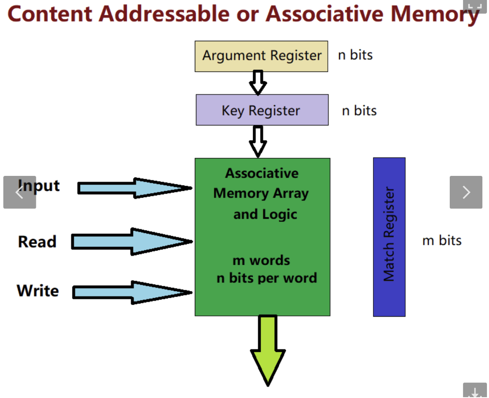
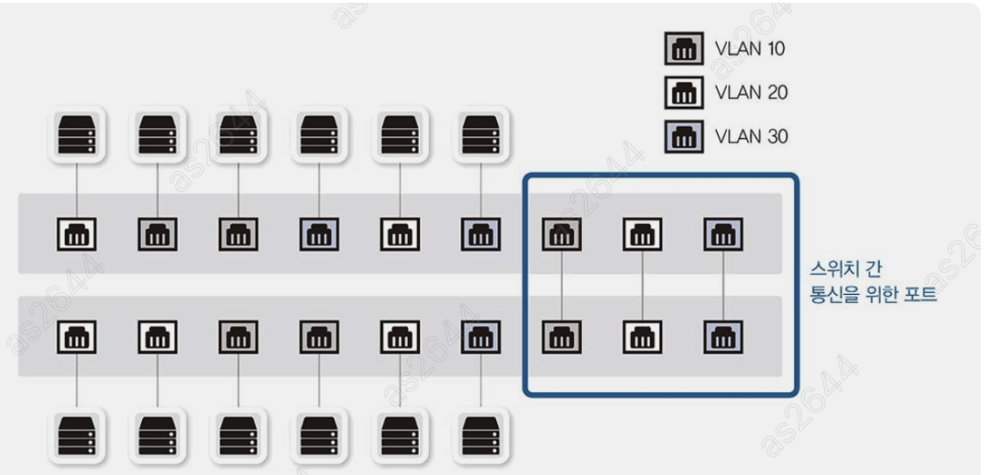

# 4장 스위치: 2계층 장비

## 스위치 장비
2계층  mac address 를 기반으로 동작한다.

- mac 주소를 인식하고 패킷을 전달
- 한 대의 장비에서 논리적으로 네트워크를 분리하는 VLAN
- STP(Spanning Tree Protocol) 네트워크 루프 방지 기능

> 2계층의 PDU(header + data) 는 엄밀히 말하면 프레임이지만, 데이터를 쪼개서 전달하는 데이터를 패킷이라고 통칭하고 있어 패킷이라고 사용

### mac 주소 테이블
스위치는 mac 주소와 포트 정보가 매핑된 테이블을 갖고 있어서,
패킷 헤더 안에 있는 2계층 목적지 주소를 확인하고 해당 포트로 전송한다.

mac 주소 테이블은 스위치 내부 메모리인 CAM(Content Addressable Memory)에 저장되어 CAM 테이블이라고도 부른다.  
내용 검색기반(associative lookup)을 하기 때문에 일반 RAM이 인덱스나 주소 기반으로 찾는것과 달리
모든 메모리의 데이터를 동시에 조회하기 때문에 비용은 비싸지만 빠른 검색이 가능하다.

**조회 (병렬검색)**

- row 를 가진 배열 mac 주소를 저장하고, 각 행마다 match register이 있음
- 데이터가 들어오면 각 행의 match register이 동시에 bit를 비교한다.
- 일치하는 행이 있으면 match 신호를 출력해서 결과를 반환

**저장 및 데이터 관리**

- 데이터가 들어올 때 테이블에 주소가 없으면 새롭게 저장
- 일정 기간동안 해당 mac 주소가 사용되지 않으면 해당 항목은 제거됨(aging timer) 300s ~ 500s 사이

=> 스위치 뿐 만 아니라 라우터 테이블, 캐시, 데이터베이스 관리 시스템 등에도 활용된다고 함.
https://www.ciscopress.com/articles/article.asp?p=3089352&seqNum=6

### 플러딩
초반의 스위치는 네트워크 정보가 없기 때문에 허브처럼 패킷을 모든 포트로 전달하는 현상 
정상적인 현상이지만 해당 동작이 많아지면 스위치가 제 기능을 못할 수 있다.

- 실제 이더넷 -TCP/IP 네트워크에서는 ARP 브로드캐스트를 미리 주고받아서 스위치가 플러딩하지 않음.
   - 네트워크 통신 전 ARP 프로토콜로 상대방의 mac 주소를 미리 알아내기 때문
- 엉뚱한 mac 주소를 습득시키거나 mac 테이블을 꽉 차게 하면 플러딩이 유도되므로 주의
- ARP poisoning : 모니터링해야할 ip mac 주소가 공격자 자신인 것처럼 속여서 원하는 통신을 얻는 방법

 

### 어드레스 러닝
mac 주소 테이블을 만들고 유지하는 과정

- 패킷이 들어오면 출발지의 mac 주소와 포트번호를 테이블에 기록
- 출발지 기준으로 학습하기 떄문에 목적지 mac 주소 필드에서만 사용되는 브로드캐스트나 멀티캐스트의 mac 주소는 학습할 수 없음

> 스위치 간 통신을 위해 어드레스 러닝말고 사전에 정의된 mac 주소 정보가 있음.
이는 스위치에서 자체처리하기 때문에 cpu 혹은 관리 모듈을 지칭하는 용어로 표기되곤 한다.

 

### 포워딩/필터링
스위치는 해당 mac 주소에 매핑되어있는 포트로만 패킷을 포워딩하는 필터링 동작을 수행
통신이 다른 포트에 영향을 주지 않아서 포워딩/필터링 작업이 여러 포트에서 동시에 수행될 수 있다.

유니캐스트에 대해서만 포워딩과 필터링 작업을 수행한다.
BUM 트래픽인 브로드캐스트, 언노운 유니캐스트, 멀티캐스트는 모두 출발지가 사용되지 않아서 모두 플러딩 됨.

> LAN에서의 ARP  
> - 보통 ARP 브로드캐스트를 먼저 수행해서 유니캐스트가 플러딩 되는 경우는 거의 없다. 
> - ARP, mac 테이블은 일정 기간동안 지워지지 않는 aging time을 갖고 있는데, 보통 mac이 ARP 보다 길기 때문에 플러딩 없이 효율적으로 통신을 관리할 수 있다.

---

## VLAN
LAN을 논리적으로 분할하고 구성하는 기술로, 하나의 물리 스위치에서 여러 개의 네트워크로 나누어 사용할 수 있다.

VLAN은 브로드캐스트 트래픽이 네트워크 전체에 전파되는 것을 방지하고, 특정 그룹 내 장비끼리만 통신할 수 있도록 격리할 수 있어 보안 상으로도 이점이 있다.

> 하나의 장비를 논리적으로 분리한 것이기 때문에 브로드캐스트도 VLAN 간에 통신할 수 없으며,
분리된 단말 간에는 3계층 장비를 통해서 통신해야한다.

 

### VLAN  종류와 특징

**포트 기반**
스위치를 논리적으로 분할해 사용하는 것이 목적인 VLAN

- VLAN 선정 기준이 스위치의 “포트"이기 때문에 어떤 단말이 접속하든지 스위치의 특정 포트를 연결하면 해당 VLAN에 속하게 됨
- 보통 대부분의 VLAN은 포트 기반에 해당

**mac 주소 기반 (dynamic VLAN)**
- 스위치에 고정되어있는 포트에 VLAN을 할당하는 것이 아니라, 단말의 mac 주소를 기반으로 VLAN을 할당
  - PC의 mac 주소를 기반으로 할당하기 때문에, 어떤 포트에 접속해도 동일한 VLAN이 할당된다.
  - mac주소와 VLAN이 매핑되어있음
  - 매핑되어있는 VLAN 정보가 달라지면 할당된 VLAN도 변경되기 때문에 동적 매핑이 가능
- 단말의 mac 주소를 인식한 스위치가 해당 포트를 VLAN으로 변경

 

### VLAN  모드(Trunk/Access) 동작방식

VLAN이 다르면 다른 스위치에 연결된 것과 동일하므로, 
만약 한 대의 스위치에 연결되더라도 서로 다른 VLAN이 설정된 포트끼리는 통신할 수 없다. (3계층 장비 사용)
 

즉, 여러 개 VLAN이 존재하는 상황에서 스위치를 연결해야한다면 VLAN 개수만큼 포트를 연결해주어야하는데, 
대형 네트워크에서 이런 방식으로 연결하면 장비 연결만으로도 많은 포트가 낭비되는 문제

 

### Tag(Trunk) 포트
하나의 포트에 여러 VLAN을 함께 전송할 수 있도록 태그 기능을 제공하는 포트
- 태그 포트로 패킷을 보낼 때는 이더넷 프레임 중간에 VLAN ID 필드를 추가
- 수신 측에서는 VLAN ID를 제거해서 해당 VLAN으로 패킷을 전송

### Access(untag) 포트
태그 포트가 아닌 일반적인 포트, 하나의 VLAN에 속한 경우만 사용된다.  

=> 서버와 연결된 포트도 가상화 서버가 연결될 떄는 여러 VLAN과 통신해야하는 경우가 생기는데, 이는 서버와 연결된 스위치의 포트더라도 tag 로 설정한다.  
- 물리 서버에 언태그 포트가 있어도 가상 서버처럼 VLAN이 여러 개라면 통신할 때 태그 포트로 설정해서 통신해야함

---

# STP
SPoF(Single Point of Failure) 로 인한 장애를 막기 위해 이중화, 다중화된 네트워크 디자인을 구성한다.
예를 들어 네트워크를 스위치 하나로 구성하면, 해당 장비에서 장애가 발생했을 시 전체 네트워크 장애로 전파되므로
스위치를 두 대 이상으로 두는 디자인을 사용
- 패킷이 네트워크를 따라 계속 전송될 수 있는 네트워크 루프가 발생할 수 있어 방지가 필요하다.

### 루프
네트워크 연결된 모양이 고리처럼 되돌아오는 형태

### 브로드캐스트 스톰
- 루프 구조로 연결된 상태에서 브로드캐스트를 발생하면, 해당 패킷이 모든 포트로 플러딩을 시행
이 패킷은 다른 스위치에서도 다시 플러딩
- 루프 구조에서는 계속 패킷이 돌면서 브로드캐스트 스톰을 발생시킨다.

=> 2계층 헤더에는 TTL 라이프사이클이 없기 때문에 패킷이 죽지 않고 네트워크 대역폭을 다 차지해버림

 

**스위치 mac 러닝 중복문제**
출발지 mac 주소를 학습해야하는데, 루프 구조에서는 패킷 데이터와 스위치를 돌아들어간 패킷 간의 포트가 달라서 주소학습이 어려워진다. 
- mac 주소와 포트가 1:1 매핑으로만 저장되는 구조여서 계속 테이블이 갱신되는 address Flapping 발생
  - 스위치가 정상적으로 동작하지 못하고 패킷을 플러딩하는 결과

루프가 생기지 않도록 루프 구성 포트 중 하나를 차단하는 방법도 있으나, 초기 SPoF를 예방하기 위한 목적에는 부합하지 않는다. 또한 차단된 포트를 다시 사용하게끔 하려면 수동으로 개입해야하기 때문에 적절히 대응할 수 있는 프로토콜이 필요해졌다.

### STP (Spanning Tree Protocol)
루프 상태를 감지해서 포트를 차단하고, 장애 때문에 우회로가 없다면 차단된 포트를 스위치 스스로 풀어주는 프로토콜
(루프를 예방한다.)

- 전체 스위치 연결상황을 파악하는 BPDU(Bridge Protocol Data Unit) 프로토콜을 사용해서 스위치 간 서로의 정보를 전달
  - BPDU는 주로 예약된 멀티캐스트 주소로 전송함  
  - 지정포트 (designated port_)를 통해 인접한 스위치로 전송된다.  
- 해당 데이터를 통해 네트워크 트리를 만들어서 루프가 생길만한 구조를 파악
- 루프 지점을 데이터 트래픽이 통과하지 못하도록 차단해서 예방

 

### 스위치 포트의 상태 및 변경과정
일차적으로 스위치 포트에 만약 신규 스위치가 연결되면 바로 트래픽이 들어오지 않도록 차단하고,
해당 포트로 트래픽이 흘러도 되는지 BPDU를 통해 학습하고 구조를 체크한 다음 루프 구조인 경우에는 차단 상태를 유지하는 과정을 거친다.

1) Blocking
   - 패킷 데이터를 차단한 상태로 상대방의 BPDU를 대기
   - max age : 20s 동안 대기하고, 후순위 BPDU를 받으면 리스닝으로 변경된다.
   - 2초 씩 10번의 BPDU를 기다린다.

2) Listening
   - 해당 포트가 전송상태로 변경되는 것을 결정하고, 준비하는 단계
   - 자신의 BPDU 정보를 상대방에게 전송한다.
   - 15초 대기

3) Learning  
   - 이미 해당 포트를 포워딩하기로 결정하고 mac 주소를 학습하는 단계
   - 15초 대기

4) Forwarding
   - 패킷을 포워딩해서 정상적으로 통신

위와 같은 과정을 거치기 떄문에 스위치에 장비를 새롭게 붙이면 통신하는데 50초 가량 소요되는데,
연결된 단말이 스위치일 수 있어 해당 정보까지 파악하기 위해 일반 단말도 동일하게 적용된다.

링크 전환도, 특정 링크가 다운되어 블로킹 포트가 포워딩되기 위해 20초 동안 max age를 거친다.
- 하지만 다운된 링크가 자신의 인터페이스면, 토폴로지가 변한 것을 감지할 수 있어서 리스닝 단계부터 즉시 이루어져서 30초만에 절체됨.

> STP가 활성화되면 바로 스위치 포트가 포워딩 상태가 되지 않기 때문에,  
비교적 부팅 시간이 빠른 OS가 DHCP  네트워크에 접속 시에는 ip를 정상적으로 할당받지 못하는 케이스도 발생

---

### STP 동작방식
STP는 루프를 없애기 위해 토폴로지를 구성한다.  
네트워크 상에서 root 스위치를 선출하고 이 스위치를 통해서 모든  BPDU가 교환되는데,
초반에는 모두가 루트 스위치로 스스로를 인식한다.  
- 새 스위치가 들어오면 브릿지 ID값을 비교해서 더 적은 스위치가 루트가 됨.

- 하나의 루트 스위치가 BPDU 프로토콜을 옆 스위치로 전달하고
  - 다른 스위치 중 하나를 루트 포트로 선정
  - 하나의 세그먼트에 하나의 지정포트(designated) 포트를 선정
- 스위치 간 연결에서 이미 루트 포트로 선정된 경우, 반대편은 지정포트로 선정되어 모두 포워딩 상태가 된다.
  - 아무도 루트포트가 아니면, 하나는 지정포트 하나는 대체포트가 되어 차단이 됨

> 스패닝 프로토콜 사용 시 대안 (Port Fast)
- 스위치가 아닌 일반 PC나 서버가 연결되는 포트는 Port fast로 설정해서 곧바로 포워딩 상태로 포트를 사용할 수 있다.
  - 하지만 이 설정이 적용된 포트에 스위치가 접속하면 루프가 생길 수 있어 이런 포트를 차단하는 BPDU Guard 기술이 같이 사용되어야한다.

---

### 향상된 STP (RSTP, MST)
동일한 네트워크에 속한 스위치까지  BPDU 가 전달되는 시간도 고려해야하는데,  
포워딩이 되기까지 30~50초 정도 소요되다보니 TCP  기반 애플리케이션은 30초를 기다리지 못해 통신이 끊기는 등의 이슈가 있다.

**RSTP (Rapid STP)**  

STP는 스위치 중 하나가 문제가 발생하면 백업경로를 활성화하는데 30~50초가 걸리는 문제  
RSTP는 2~3초로 절체 시간이 짧아서 TCP  기반 애플리케이션이 세션을 유지할 수 있다.  
- RSTP는 8비트를 모두 활용해서 스위치가 댜앙한 정보를 주고받을

=> 기존에는 말단 스위치 → 루트 브릿지까지 변경사항을 보고하고 다시 말단 스위치까지 보내는 과정을 거쳤음  
=> RSTP는 토폴로지 변경이 일어난 스위치가 모든 네트워크에 변경을 직접 전파하기 때문에 빠르다.

 

**MST**

- **CST (일반 스패닝 트리 프로토콜)**  : VLAN  개수와 상관없이 한 개만 동작
  - 스위치 관리 부하가 적다.
  - 포트를 하나만 사용하다보니 VLAN 별 최적의 경로를 활용할 수 없다.
- **PVST (peer Vlan spanning tree)**, VLAN 마다 별도의 경로와 트리를 만들 수 있게 해놨음
  - 한개의 포트랑 회선만 활성화 되어서 효율적으로 디자인할 수 있다.
  - 스위치에 더 많은 관리 부담이 됨.

**MST**
- 여러 개의 VLAN을 그룹화하고, 그룹 별로 스패닝 트리가 동작
  - 리전 개념도 있음.
  - 예) 11-50 VLAN 과 101-150  VLAN 이 있으면 각각을 리전으로 묶고, 두 개의 스패닝 트리를 만들어두면 2개로 100개의 VLAN을 관리하는 셈

 

> 스패닝 프로토콜의 대안
- 루프 예방에는 필수적이지만, 스위치에 부담이 많이 가는 프로토콜
- 근본적으로 대체하기 위해서는 네트워크를 잘게 쪼개서 디자인하거나, 대체 프로토콜을 사용
  - 다만 대체 프로토콜은 호환성이 떨어지는 경우가 있다.
  - SLPP, Extreme STP, Loop Guard, BPDU Gaurd

